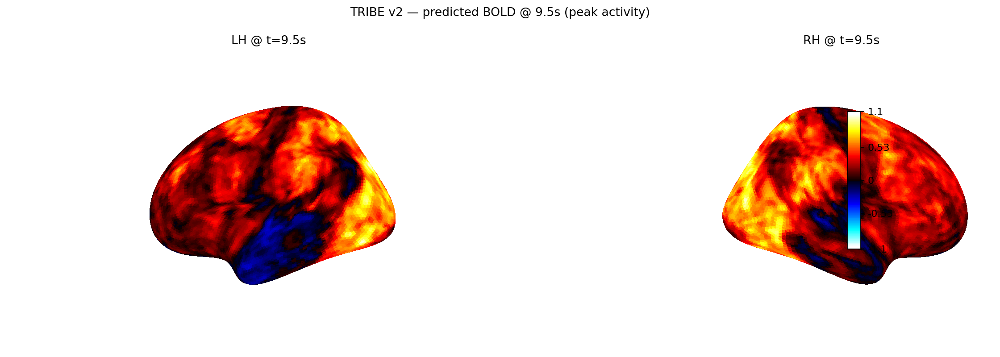

# 🐱 Jemma — offline brain-response explainer powered by Gemma 4 & TRIBE v2

> **Built for the Gemma 4 Good Hackathon 2026.** A local-only Discord bot
> that turns any short video into (1) a predicted cortical activity map
> and (2) three plain-language narrations — for a layperson, a clinician,
> and a researcher. No data ever leaves the machine.

<p align="center">
  
</p>

<p align="center">
  <a href="SETUP.md"></a>
  <a href="HACKATHON_PLAN.md"></a>
  <a href="#one-command-install"></a>
  
  
  
  
  
</p>

---

## The one-sentence pitch

**Jemma is a privacy-preserving brain-response explainer** — drop a video
clip into a Discord channel, and Gemma 4 E4B (running locally via Ollama)
plus Meta's TRIBE v2 foundation model (on a single consumer GPU) give you
back a predicted cortical activation map *plus* a plain-English narration
tailored to your expertise level. All inference stays on the machine.
Medical offices, classrooms, and accessibility reviewers can use this
without a cloud, a PACS hookup, or HIPAA review.

---

## Why this is a Gemma 4 Good submission

The hackathon rewards AI that is **innovative, high-impact, technically
executed, and runnable on limited-compute / offline devices.** Jemma was
designed around that rubric from day one:

| Dimension | How Jemma hits it |
|---|---|
| **Innovation** | First open pipeline coupling a brain-response foundation model (TRIBE v2) with an on-device multimodal LLM (Gemma 4 E4B) as the *explainer*. Gemma speaks brain. |
| **Impact — Health & Sciences** | Teaches patients and neurodivergent users what a stimulus would do to their cortex. Sensory-overload flagging for autism/ADHD/photosensitive-epilepsy. Local-only = HIPAA-compatible by design. |
| **Impact — Digital Equity** | Full stack runs offline. Gemma 4 E4B (UD-Q4_K_XL quant) fits in **~5 GB RAM**; even the RTX 5090's TRIBE pass can be swapped for the lighter fsaverage-5 head on a 3090. Works in rural clinics, research stations, and air-gapped labs. |
| **Impact — Education** | Three-tier narration (layperson / clinician / researcher) is explicit inclusive design — the same predicted brain map, spoken in three voices. Useful in intro-neuroscience courses, patient-facing fMRI explainers, and research onboarding. |
| **Technical execution** | Real TRIBE v2 inference (30.8 GB VRAM peak), real Gemma 4 E4B via Ollama, structured-JSON logging, retry-on-failure job queue, graceful shutdown, live Claude-API log diagnosis. Not a demo mock. |
| **Offline deployability** | `./install.sh` or `.\install.ps1` — single command. Dockerfile + docker-compose with GPU passthrough. Zero cloud dependencies at runtime. |

> **Why Jemma and not just "TRIBE"?** Brain foundation models speak in
> 20,484-dimensional BOLD traces. Nobody reads that directly. Jemma uses
> Gemma's multimodal reasoning to *translate* TRIBE's output into language
> at three levels of expertise — and Gemma *also* does the vision gate
> (does this clip actually contain a brain-worthy stimulus?). Gemma is
> not a wrapper; it's the interpretive organ of the system.

---

## What Jemma does — the three-stage pipeline

```
user drops an .mp4/.wav/.mov into Discord
     │
     ▼  Stage A  (~2 s — Gemma vision gate)
     │  Ollama runs Gemma 4 E4B on 4 keyframes, returns JSON:
     │    {is_cat: bool, description: "…", remark: "…"}
     │  React 👀 on progress message
     │
     ▼  Stage B  (~15 s — text-only TRIBE quick read)
     │  TRIBE v2 predicts language-cortex response to Gemma's description
     │  React ⚡, then 🧠 (full run starts)
     │
     ▼  Stage C  (~4-7 min — full multimodal TRIBE on the RTX 5090)
     │  V-JEPA2-ViT-g + wav2vec-BERT + Llama-3.2-3B frozen feature stacks
     │    → 8-layer transformer head
     │    → predicted BOLD on 20,484 fsaverage5 vertices @ 2 Hz
     │  Schaefer-400 ROI aggregation → peak-cortex PNG
     │
     ▼  Three Gemma calls → layperson / clinician / researcher narration
     │
     ▼  Discord reply: embed with all three tiers + cortex PNG attached
     ✅
```

See [`bot/README.md`](bot/README.md) for per-stage wall-clock / VRAM /
power numbers measured on the 5090.

---

## One-command install

```bash
# Linux / macOS / git-bash on Windows
git clone https://github.com/AlexiosBluffMara/TRIBEV2.git
cd TRIBEV2
bash install.sh          # or: bash install.sh --cpu  (Mac / no-GPU)
# edit .env to add DISCORD_TOKEN + HF_TOKEN (see SETUP.md)
bash start_bot.sh
```

```powershell
# Windows PowerShell
git clone https://github.com/AlexiosBluffMara/TRIBEV2.git
cd TRIBEV2
.\install.ps1
# edit .env to add DISCORD_TOKEN + HF_TOKEN (see SETUP.md)
.\start_bot.ps1
```

The installer:
- checks Python 3.11+, ffmpeg, optional NVIDIA driver
- creates `.venv`, installs PyTorch (cu128 by default, CPU with `--cpu`)
- installs all Python deps + TRIBE v2 source editable
- installs / verifies Ollama and pulls `gemma4:e4b-it-q8_0`
- creates `.env` from `.env.example`
- creates runtime dirs (`uploads/`, `outputs/`, `logs/`, `tribev2_cache/`)
- is **idempotent** — safe to re-run

Full walkthrough (Discord token, HF token, Docker, troubleshooting) in
[`SETUP.md`](SETUP.md).

---

## Production features (already built)

- **Structured JSON logging** — rotating `logs/jemma.jsonl` (10 MB × 5) +
  coloured console. One line per event, grep-friendly. See
  [`bot/logger.py`](bot/logger.py).
- **Pipeline job queue** — `asyncio.Queue` worker with `MAX_RETRIES=3` and
  per-attempt Discord progress updates. Jobs that fail transiently retry
  automatically; exhausted jobs get a ❌ reaction + error message.
- **Graceful shutdown** — Ctrl-C / SIGTERM fires a `close()` override that
  posts `🔴 Jemma is going offline` to `DISCORD_STATUS_CHANNEL_ID`,
  cancels the worker, and closes the client cleanly.
- **Online/offline announcements** — `🟢 Jemma is online` on `on_ready`
  after TRIBE pre-warms. Ops visibility without extra infra.
- **Live Claude-API log watcher** — [`bot/watch_logs.py`](bot/watch_logs.py)
  tails `jemma.jsonl`, batches errors, calls `claude-sonnet-4-6` to
  diagnose, and offers to apply simple PATCH blocks interactively.
- **Cross-platform** — Bash / PowerShell launchers, Dockerfile +
  docker-compose with Ollama sidecar and NVIDIA GPU passthrough.
- **Windows subprocess fixes** — all ffmpeg / ffprobe / nvidia-smi calls
  run with `CREATE_NO_WINDOW` so the asyncio thread pool doesn't trip
  `[WinError 87]`.

---

## Repository map

| Path | Purpose |
|---|---|
| [`bot/`](bot/) | Discord bot code (see [`bot/README.md`](bot/README.md)) |
| [`bot/bot.py`](bot/bot.py) | Main entrypoint — queue, worker, slash commands |
| [`bot/pipeline.py`](bot/pipeline.py) | TRIBE v2 loader + inference helpers |
| [`bot/cat_gate.py`](bot/cat_gate.py) | Gemma 4 vision classifier (Stage A) |
| [`bot/tiers.py`](bot/tiers.py) | Three-tier narrator (Stage C post) |
| [`bot/logger.py`](bot/logger.py) | Rotating JSON + colour console logger |
| [`bot/watch_logs.py`](bot/watch_logs.py) | Claude API log diagnostician |
| [`install.sh`](install.sh) / [`install.ps1`](install.ps1) | One-command installers |
| [`Dockerfile`](Dockerfile) + [`docker-compose.yml`](docker-compose.yml) | Containerised deploy with Ollama sidecar |
| [`tribe_v2_5090_ISU_demo.ipynb`](tribe_v2_5090_ISU_demo.ipynb) | Original research notebook (slide-ready) |
| [`HACKATHON_PLAN.md`](HACKATHON_PLAN.md) | Full hackathon submission strategy |
| [`DEMO_SCRIPT.md`](DEMO_SCRIPT.md) | 3-minute video recording plan |
| [`SETUP.md`](SETUP.md) | Token acquisition + Docker + troubleshooting |

---

## Hardware profile (measured on RTX 5090, 32 GB VRAM, 20 s 480p clip)

| Stage | Wall | VRAM peak | GPU util | RAM peak |
|---|---|---|---|---|
| Gemma vision (4 frames) | 1.4 s | 17.9 GB | 80% | 25 GB |
| TRIBE load | 6.3 s | 19.7 GB | 80% | 27 GB |
| TRIBE text-only fast path | ~15 s | 28 GB | 95% | 34 GB |
| **TRIBE full multimodal** | **~450 s** | **30.8 GB** | **98%** | **38 GB** |
| Visualize peak PNG | 2.4 s | 18.7 GB | 8% | 28 GB |
| Gemma three-tier narration | ~6 s | 17.9 GB | 25% | 28 GB |

Keeping Gemma evicted (`keep_alive: 0`) is what pins peak at 30.8 GB
instead of overflowing a 32 GB card.

---

## Beyond cats — the real use cases

The cat demo is the fun entry point, but the architecture is
species-agnostic and modality-agnostic:

- **Patient-facing fMRI explanation** — show a patient the predicted
  activity for a stimulus and read them the layperson tier.
- **Sensory-overload flagging** — run any stream (movie trailer, TikTok,
  classroom video) and flag seconds where predicted
  sensory-cortex-aggregate exceeds a threshold. Inclusive design for
  autistic users, migraine sufferers, photosensitive-epilepsy patients.
- **Content-safety review** — PDF export of risky seconds for media
  pre-release QA.
- **Neuroscience teaching** — real-time cortex prediction during a
  lecture clip, no MRI time required.
- **Veterinary cognition research** — use with animal stimuli for
  feline/canine cortical-response proxy (with appropriate caveats —
  TRIBE v2 was trained on humans).

See [`HACKATHON_PLAN.md`](HACKATHON_PLAN.md) for the full impact write-up
and ISU/Carle research collaboration plan.

---

## Credits, licenses, upstream

- **TRIBE v2** — Meta AI, CC-BY-NC 4.0.
  [Code](https://github.com/facebookresearch/tribev2) ·
  [Weights](https://huggingface.co/facebook/tribev2) ·
  [Paper blog](https://ai.meta.com/blog/tribe-v2-brain-predictive-foundation-model/)
- **Gemma 4 E4B** — Google DeepMind, Gemma Terms of Use.
  Served via [Ollama](https://ollama.com/) (Apache 2.0).
  Unsloth GGUFs: [`unsloth/gemma-4-E4B-it-GGUF`](https://huggingface.co/unsloth).
- **Llama 3.2 3B** — Meta, Llama 3.2 Community License (text feature stack).
- **V-JEPA2 / wav2vec-BERT** — Meta & friends; see TRIBE v2 model card.
- **Schaefer-400 atlas** — Schaefer et al. 2018, fsaverage5 mesh from
  [nilearn](https://nilearn.github.io/).
- This project's own code (excluding upstream) is open-source under
  Apache 2.0 for unambiguous reuse.

---

## Contact / questions

Open an issue or find the `#jemma-status` channel in the Discord where
the bot is deployed. For research collaboration
(Follmann + Bhattacharya group at Illinois State University, or Carle
Health), see [`HACKATHON_PLAN.md`](HACKATHON_PLAN.md) §10.
